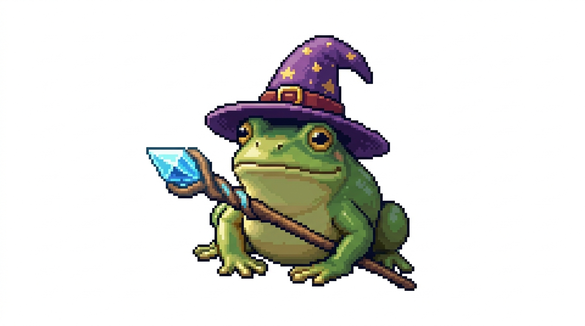

  <h1>Hi, I'm Neville Galletly</h1>
  
<b>Junior Full-Stack Developer | London, UK </b>

---

I'm a recent graduate of **Northcoders'** full-stack software development bootcamp, currently seeking my first role in software engineering. While I enjoy working across the entire stack, I'm particularly focused on **backend development**—specifically RESTful API design and server engineering. 

Right now, I'm deepening my backend skills by learning **Python** and **C#** to complement my JavaScript foundation. I thrive in collaborative environments where clear communication and steady progress are valued.

 

###  Tech Stack
* **Languages:** JavaScript (Node.js), TypeScript, SQL, Python (Learning), C# (Learning)
* **Backend:** Express.js, PostgreSQL, RESTful APIs, Database Design
* **Frontend:** React, React Native (Expo), HTML5, CSS3, Accessibility
* **Testing:** TDD (Jest, Supertest)
* **Methodologies:** Agile, SCRUM, Pair Programming

---

### Projects

#### 📚 Borough Books

A full-stack mobile application for tracking book loans within a community. I built the Express server from scratch, designed and implemented the PostgreSQL database schema (8 tables), and developed 15+ RESTful endpoints supporting CRUD operations.

* **Key Tech:** React Native, Node.js, PostgreSQL, Supabase WebSockets.
* **Features:** Barcode scanning integration and complex SQL JOINs for relational data tracking.

#### Emerald News
A news aggregation platform with voting, commenting, and topic filtering. I focused heavily on backend architecture—designing the API, building the Express server, and managing database migrations.

 

---

 Beyond the Code
When I'm not coding, you'll find me **Powerlifting** (training for my first competition late 2026) or practicing **Muay Thai**, having visited Thailand last year to train. I’m a regular at the **Royal Opera House** for ballet and theatre, and a dedicated **Dungeons & Dragons** player.

I’m an alternative music enthusiast and a massive fan of Science Fiction and Fantasy—both in books and on screen. I'm always happy to chat about tech, collaborate on projects, or discuss the finer points of a good fantasy novel.

  

---

  <b>Open to Junior Full-Stack or Backend roles in London. Let's connect!</b> 
   

